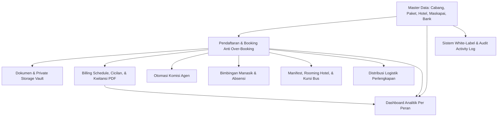
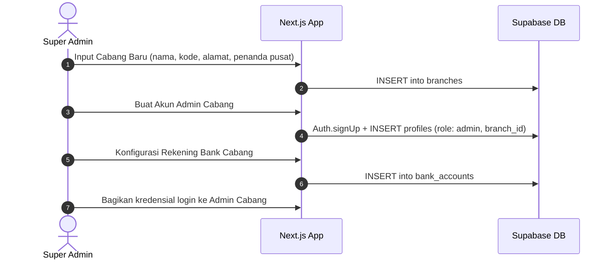
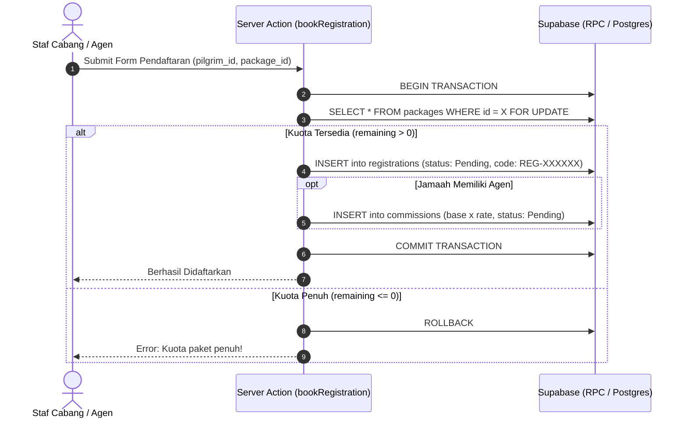
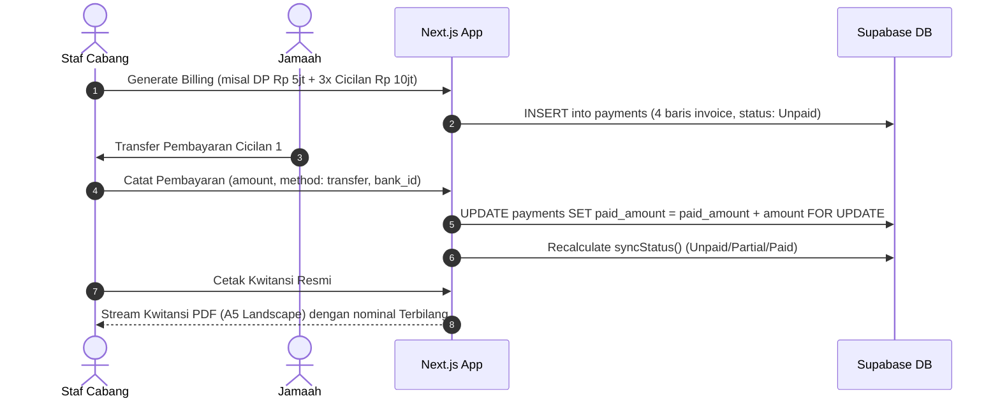
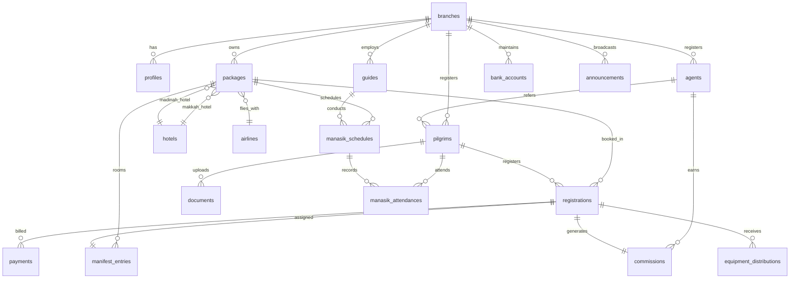
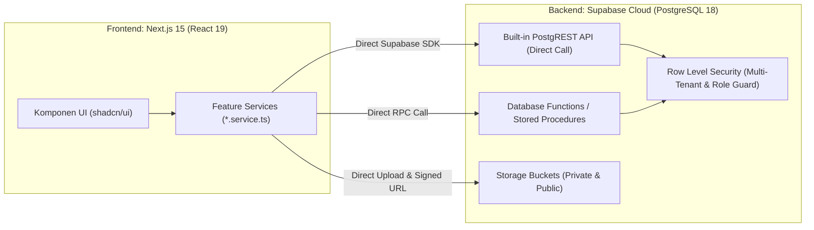

# Project Brief: Replikasi Sistem Manajemen Travel Umroh & Haji
### Modern Web Application (Next.js 15, shadcn/ui, Supabase)

---

## 1. Product Vision

Platform web modern **multi-tenant (multi-cabang)** dan **white-label** generasi baru untuk mengelola operasional travel umroh & haji secara menyeluruh: mulai dari pendaftaran calon jamaah, checklist dan verifikasi dokumen privat, skema penagihan & pembayaran cicilan fleksibel, bimbingan manasik, pembagian manifest & rooming hotel/bus, distribusi logistik perlengkapan, hingga otomasi komisi agen — dilengkapi dengan dashboard analitik interaktif per peran pengguna.

Aplikasi ini mereplikasi dan memodernisasi fondasi sistem sebelumnya (Laravel 13) ke dalam arsitektur modern berbasis **Next.js 15 (App Router)**, komponen antarmuka premium **shadcn/ui (Tailwind CSS)**, dan infrastruktur backend cloud **Supabase (PostgreSQL, Supabase Auth, Storage RLS, Edge Functions)**.

**Positioning**: Solusi SaaS operasional travel umroh/haji yang *production-ready*, aman, cepat, dan responsif (desktop & mobile-friendly), siap digunakan oleh kantor pusat maupun jaringan cabang travel.

---

## 2. Core Principles

Produk ini dibangun berlandaskan 5 prinsip dasar:

1. **Isolasi Data Multi-Tenant yang Ketat (Tenant Isolation by Design)**:
   Setiap cabang memiliki otonomi operasional penuh. Data jamaah, pendaftaran, manifest, dan arus kas cabang A terisolasi secara mutlak dari cabang B melalui kebijakan **PostgreSQL Row Level Security (RLS)** di level database Supabase, dengan kemampuan Super Admin untuk mengelola lintas cabang.
2. **Integritas Transaksi & Anti Over-Booking (Concurrency Protection)**:
   Pemesanan kuota paket dan pencatatan pembayaran dilindungi oleh transaksi *concurrency control* (`FOR UPDATE` locking di level PostgreSQL / Supabase RPC). Sistem menjamin tidak akan pernah terjadi over-booking kuota meskipun pendaftaran dilakukan secara serentak.
3. **Keamanan Data Pribadi & Vault Privat (Zero Unauthorized Access)**:
   Dokumen sensitif jamaah (Paspor, KTP, KK, Buku Nikah, Sertifikat Vaksin) disimpan di *Private Storage Bucket* Supabase yang terisolasi total dari web publik. Akses berkas hanya diizinkan melalui *Short-Lived Signed URLs* (10–15 menit) yang diverifikasi oleh hak akses peran pengguna.
4. **Desain Antarmuka Premium, Elegan & Responsif (shadcn/ui Excellence)**:
   Mengedepankan estetika kelas atas dengan tipografi modern, kartu statistik informatif, tabel data interaktif dengan filter multi-kondisi, visualisasi grafik yang hidup (Recharts), dan komponen UI yang konsisten berbasis desain sistem shadcn/ui.
5. **Skalabilitas Arsitektur Tanpa Beban Server Tradisional (Serverless First)**:
   Memanfaatkan Next.js Server Components (RSC) untuk rendering instan, Server Actions untuk mutasi data type-safe, dan Supabase Database Functions untuk kalkulasi komputasi berat, memungkinkan sistem beroperasi dengan performa tinggi dan biaya operasional rendah.

---

## 3. Core Concept: Struktur Role & Modul

Sistem menstrukturkan akses ke dalam **5 Peran Pengguna (RBAC)** dan **10 Modul Fungsional Utama**:

### 3.1 Struktur 5 Peran Pengguna (Roles)

| Peran | Target Pengguna | Ruang Lingkup Hak Akses |
|---|---|---|
| `super_admin` | Owner / Direksi Travel | Akses penuh seluruh cabang, tata kelola cabang, branding white-label, monitoring agregat, reset password |
| `admin` | Kepala Operasional / Staf Cabang | Operasional penuh dalam 1 cabang: paket, jamaah, verifikasi dokumen, billing, absensi, manifest |
| `agent` | Mitra Pemasaran / Agen Travel | Daftarkan jamaah referral, upload dokumen jamaah binaannya, pantau progres pembayaran & komisi |
| `pilgrim` | Jamaah Umroh / Haji | Portal pribadi: cek status pendaftaran, checklist & unggah dokumen, histori tagihan, countdown keberangkatan |
| `guide` | Muthawif / Pembimbing Ibadah | Bimbingan jamaah: pantau rombongan, riwayat kesehatan, mahram, dan pencatatan absensi manasik |

### 3.2 Modul Utama yang Saling Terintegrasi



---

## 4. Target User

### Untuk Siapa:
* **Travel Agency Umroh & Haji** (skala menengah hingga enterprise yang memiliki banyak cabang atau mitra agen).
* **Tim Operasional Cabang**: Staf ticketing, handling bandara, keuangan kasir, dan verifikator dokumen.
* **Mitra Agen Lepas / Korporasi**: Pemasar paket yang membutuhkan transparansi perhitungan komisi.
* **Muthawif Lapangan**: Pembimbing ibadah di tanah air dan tanah suci untuk absensi dan koordinasi jamaah.
* **Jamaah & Keluarga**: Jamaah yang membutuhkan kepastian jadwal, dokumen, dan transparansi tagihan.

### Bukan Untuk:
* Aplikasi marketplace publik e-commerce terbuka (bukan agregator tiket ala Traveloka).
* Publik umum tanpa akun yang didaftarkan resmi oleh staf travel / agen.

---

## 5. Feature Breakdown (Detail Modul Spesifik)

### 5.1 Landing Page & Profil White-Label (Publik)
* **Branding Dinamis**: Nama travel, tagline, alamat kantor, email, telepon, dan warna tema (`--primary`) yang dikonfigurasi via database.
* **Katalog Paket Terbuka**: Informasi paket umroh & haji yang sedang aktif (durasi, kota keberangkatan, hotel Mekah & Madinah, maskapai, fasilitas included/excluded, sisa kuota *real-time*).
* **Pusat Akses Login**: Gerbang masuk aman menuju portal per peran tanpa registrasi terbuka.

### 5.2 Dashboard Interaktif Per Peran (Recharts)
* **Super Admin / Admin**:
  * Ringkasan metrik: Total Jamaah, Total Pendaftaran Aktif, Total Omzet Masuk, Total Outstanding Tagihan.
  * Grafik Donut: Status Pembayaran Jamaah (Lunas, Sebagian, Belum Bayar).
  * Grafik Batang (Bar): Distribusi Jamaah per Paket Unggulan.
  * Grafik Garis (Line): Tren Pendaftaran 12 Bulan Terakhir.
  * Tabel Keberangkatan Terdekat: Sisa kuota, status paket, dan tanggal terbang.
  * Fitur **Branch Focus Switcher** (Super Admin): Dropdown di topbar untuk memfilter seluruh tampilan sistem ke cabang tertentu secara instan.
* **Agen (Agent Portal)**:
  * Metrik: Jumlah Jamaah Referral, Total Komisi, Komisi Telah Dicairkan, Komisi Pending.
  * Grafik Garis: Akumulasi Komisi per Bulan.
  * Donut Chart: Status Pembayaran Jamaah Referral miliknya.
* **Jamaah (Pilgrim Portal)**:
  * Widget **Countdown Keberangkatan**: Hitung mundur hari keberangkatan paket.
  * Progress Bar Finansial: Total Harga Paket vs Jumlah Dibayar vs Sisa Tagihan.
  * Checklist Kelengkapan Dokumen: Indikator persentase verifikasi berkas.
  * Jadwal Manasik Terdekat: Waktu, lokasi, dan nama muthawif pembimbing.
* **Muthawif (Guide Portal)**:
  * Metrik: Jumlah Jamaah Bimbingan, Jadwal Manasik Hari Ini, Total Kehadiran.
  * Donut Chart Rekap Kehadiran Manasik (Hadir, Sakit, Izin, Alpa).

### 5.3 Master Data Operasional
* **Cabang (Branches)**: Kelola nama kantor, kode cabang, alamat, kontak, dan penanda Kantor Pusat (`is_head_office`).
* **Paket Umroh & Haji**: Jenis paket (Umroh, Haji Khusus, Haji Plus), harga paket, kuota kursi, durasi hari, tanggal & kota berangkat/pulang, relasi ke Hotel Mekah & Madinah serta Maskapai.
* **Hotel & Maskapai**: Master hotel berbintang (Mekah & Madinah) beserta jarak ke masjid, master maskapai penerbangan (Garuda, Saudia, Emirates, dll) beserta status transit.
* **Rekening Bank**: Rekening penampungan pembayaran (BSI, Mandiri, BCA, dll) spesifik per cabang atau rekening global.
* **Agen & Muthawif**: Pengelolaan profil mitra agen (beserta persentase komisi *default*) dan muthawif pembimbing, dilengkapi fitur **Provisioning Akun Login Otomatis**.

### 5.4 Pendaftaran Jamaah & Anti Over-Booking
* **Manajemen Profil Jamaah**: NIK (16 digit), nomor paspor, masa berlaku paspor, tempat/tanggal lahir, jenis kelamin, alamat domisili, kontak darurat, riwayat penyakit/kesehatan, dan tautan mahram.
* **Pemesanan Paket (Booking Engine)**:
  * Pengecekan kuota di dalam transaksi row-lock (`FOR UPDATE`). Jika sisa kuota $\le 0$, transaksi otomatis dibatalkan dengan pesan informatif.
  * Otomasi pembuatan nomor registrasi unik (`REG-XXXXXX`).
  * Otomasi pembuatan catatan komisi agen (`commissions`) berstatus `Pending` jika jamaah memiliki referral agen.

### 5.5 Manajemen Dokumen & Private Storage Vault
* **Checklist Standar Otomatis**: KTP, Kartu Keluarga, Paspor Asli, Pas Foto 4x6 (Latar Putih), Buku Nikah / Akta Lahir, dan Sertifikat Vaksin Meningitis.
* **Penyimpanan Berkas Privat**: File dienkripsi dengan nama UUID di dalam bucket privat Supabase (`documents-vault/{pilgrim_id}/{uuid}.pdf`).
* **Proteksi Validasi Format**: Memblokir ekstensi berbahaya (PHP, EXE, JS, SVG, HTML); hanya menerima `JPG`, `PNG`, `WEBP`, dan `PDF` (maksimal 5MB).
* **Alur Verifikasi Dua Arah**:
  * Status: `Pending` $\rightarrow$ `Uploaded` $\rightarrow$ `Verified` atau `Rejected` (disertai catatan perbaikan dari admin).
  * Pengunggahan berkas ulang oleh jamaah/agen otomatis mereset status verifikasi sebelumnya.

### 5.6 Billing Cicilan, Pembayaran Kasir, & Cetak Kwitansi
* **Jadwal Tagihan Fleksibel (Bill Schedule Generator)**:
  * Pembuatan tagihan per pendaftaran atau massal per paket (`generateMassal`).
  * Konfigurasi Uang Muka (DP) + $N$ Tenor Cicilan Bulanan.
  * Penyerapan selisih pembulatan (*Rounding Remainder Absorption*) pada tagihan cicilan terakhir guna menjamin akurasi nominal hingga digit desimal terkecil.
* **Pencatatan Pembayaran Kasir**:
  * Metode bayar: Transfer Bank, Kas Tunai, EDC.
  * Sinkronisasi status tagihan otomatis: `Unpaid` ($= 0$), `Partial` ($< \text{amount}$), `Paid` ($\ge \text{amount}$).
  * Pencegahan *silent overpayment* dengan validasi outstanding tagihan.
* **Pencetakan Kwitansi Resmi**:
  * Dihasilkan instan menggunakan `@react-pdf/renderer` dalam orientasi A5 Landscape.
  * Dilengkapi konversi nominal Rupiah ke kalimat terbilang bahasa Indonesia (`terbilang()`), nomor kuitansi unik, rincian pembayaran, dan tanda tangan staf kasir.

### 5.7 Bimbingan Manasik & Presensi Jamaah
* **Penjadwalan Sesi Manasik**: Penentuan tanggal, jam, lokasi tatap muka/gedung, paket terkait, dan muthawif pengampu.
* **Presensi Kehadiran Jamaah**:
  * Antarmuka checklist presensi cepat untuk muthawif atau staf cabang.
  * Pilihan status: Hadir (*Present*), Sakit (*Sick*), Izin (*Excused*), Alpa (*Absent*).
  * Rekapitulasi persentase kehadiran per jamaah dan per sesi.

### 5.8 Manifest Penerbangan, Rooming Hotel, & Bus
* **Alokasi Kamar Hotel**: Pembagian kamar berdasarkan kategori paket: Quad (4 orang), Triple (3 orang), Double (2 orang) dengan validasi grup mahram keluarga.
* **Alokasi Transportasi**: Pengelompokan bus ziarah/bandara dan penomoran kursi pesawat per jamaah.
* **Ekspor Dokumen Operasional**:
  * **Manifest Lengkap Paket (A4 Landscape PDF)**: Data paspor, kamar hotel, dan bus untuk kebutuhan handling bandara Arab Saudi dan muassasah.
  * **Kartu Identitas Jamaah (A6 Landscape PDF)**: Kartu dada jamaah berisi foto, QR code, data paspor, hotel, dan kontak darurat muthawif.

### 5.9 Distribusi Logistik Perlengkapan
* **Pelacakan Perlengkapan Jamaah**: Koper Bagasi, Koper Kabin, Tas Paspor, Seragam Batik, Kain Ihram (Pria) / Mukena (Wanita), Buku Doa, dan ID Card.
* **Status Serah Terima**: `Pending` $\rightarrow$ `Handed Over` (mencatat tanggal dan nama staf yang menyerahkan) $\rightarrow$ `Returned` (opsional).

### 5.10 Manajemen Komisi Agen
* **Perhitungan Komisi Proporsional**: Dihitung otomatis saat booking: $\text{Harga Paket} \times \text{Rate Agen} \%$.
* **Pencairan Bertahap**: Status komisi `Pending` $\rightarrow$ `Approved` $\rightarrow$ `Paid` (dengan validasi guardrail pembayaran jamaah telah lunas).

### 5.11 Tata Kelola Sistem White-Label
* **Pengaturan Identitas Perusahaan**: Konfigurasi nama aplikasi, subjudul, alamat kantor, email resmi, nomor telepon WhatsApp, dan teks hak cipta footer.
* **Kustomisasi Tema Warna**: Pemilihan warna primer dan sekunder berbasis kode Hex yang langsung mengubah palet warna UI global (sidebar, button, badge, header).
* **Unggah Aset Branding**: Pengelolaan logo resmi dan favicon aplikasi pada Supabase Public Storage.

---

## 6. Supporting Features (Keamanan & Audit Trail)

1. **Activity Log & Audit Trail**:
   * Setiap mutasi data (`create`, `update`, `delete`, `verify`, `print`) dicatat di tabel `activity_logs` dengan menyimpan: `user_id`, `branch_id`, `action`, `subject_type`, `subject_id`, `description`, `ip_address`, dan `user_agent`.
   * Eksekusi non-blocking yang tidak mengganggu transaksi operasional utama.
2. **Provisioning & Reset Password Tanpa Email Dependensi**:
   * Pembuatan akun staf/agen/jamaah menghasilkan kata sandi sementara yang ditampilkan langsung sekali ke admin untuk disalin secara fisik/manual.
   * Tombol *Reset Password* darurat pada menu Pengguna menghasilkan kata sandi baru secara instan.
3. **Roadmap Integrasi Eksternal (Persiapan Arsitektur)**:
   * **Webhook Payment Gateway** (Midtrans / Xendit) untuk konfirmasi transfer virtual account dan QRIS secara otomatis.
   * **Gateway WhatsApp API** (Fonnte / Wablas) untuk pesan notifikasi booking, tanda terima pembayaran, dan perubahan jadwal.

---

## 7. Role & Permission Matrix

| Modul & Fitur | Super Admin | Admin Cabang | Agen Mitra | Jamaah | Muthawif |
|---|:---:|:---:|:---:|:---:|:---:|
| **Manajemen Cabang** | Full (CRUD) | View *(Own)* | — | — | — |
| **Branding White-label** | Full (Edit) | — | — | — | — |
| **Master Data (Hotel/Maskapai/Bank)** | Full (CRUD) | Full (CRUD) | — | — | — |
| **Paket Umroh & Haji** | Full (CRUD) | Full (CRUD) | View (Katalog) | View *(Paketnya)* | View *(Paketnya)* |
| **Master Agen & Muthawif** | Full (CRUD) | Full (CRUD) | View *(Diri)* | — | View *(Diri)* |
| **Data Jamaah** | Full (CRUD) | Full (CRUD) | View + Input *(Referral)* | View *(Diri)* | View *(Bimbingan)* |
| **Pendaftaran & Booking** | Full (CRUD) | Full (CRUD) | View + Input *(Own)* | View *(Diri)* | View *(Bimbingan)* |
| **Unggah Dokumen** | View + Verifikasi | View + Verifikasi | View + Unggah *(Referral)* | View + Unggah *(Diri)* | — |
| **Billing & Catat Pembayaran** | Full (CRUD) | Full (CRUD) | View *(Referral)* | View *(Diri)* | — |
| **Cetak Kwitansi PDF** | Cetak | Cetak | — | — | — |
| **Jadwal & Absensi Manasik** | Full (CRUD) | Full (CRUD) | View | View *(Paketnya)* | View + Presensi |
| **Manifest & Rooming Hotel** | Full (Kelola) | Full (Kelola) | — | — | — |
| **Distribusi Perlengkapan** | Full (CRUD) | Full (CRUD) | — | View *(Diri)* | — |
| **Komisi Agen** | Full + Payout | Full + Payout | View *(Diri)* | — | — |
| **Pengumuman Internal** | Full (CRUD) | Full (CRUD) | View (Sesuai Target) | View (Sesuai Target) | View (Sesuai Target) |
| **Manajemen Pengguna** | Full (CRUD) | Full *(Non-Super)* | — | — | — |
| **Activity Log** | View Semua | View *(Cabangnya)* | — | — | — |

---

## 8. Alur Kerja Proyek (Workflow Scenarios)

### 8.1 Flow Onboarding & Setup Cabang Baru (Super Admin)


### 8.2 Flow Registrasi Jamaah & Proteksi Kuota (Anti Over-Booking)


### 8.3 Flow Dokumen Jamaah & Storage Vault Privat
1. Admin atau Jamaah menekan tombol *"Buat Checklist Standar"* $\rightarrow$ Sistem membuat 6 baris dokumen berstatus `Pending`.
2. Jamaah / Agen mengunggah scan KTP / Paspor $\rightarrow$ File divalidasi MIME type dan disave ke bucket `documents-vault/{pilgrim_id}/{uuid}.ext`.
3. Status dokumen berganti menjadi `Uploaded`.
4. Admin cabang membuka detail dokumen $\rightarrow$ Sistem menghasilkan *Signed URL* berdurasi 10 menit untuk pratinjau aman di browser.
5. Admin memberikan verdict:
   * **Sesuai**: Status menjadi `Verified`.
   * **Tidak Sesuai**: Status menjadi `Rejected` disertai catatan perbaikan (misal: *"Scan paspor buram, mohon upload ulang"*).

### 8.4 Flow Billing Cicilan & Pembayaran Kasir


### 8.5 Flow Manifest, Rooming & Payout Komisi
1. Mendekati hari keberangkatan ($H-14$), Admin Cabang membuka menu **Manifest & Rooming**.
2. Admin mengalokasikan nomor kamar (Quad/Triple/Double), nomor bus, dan kursi pesawat sesuai kelompok mahram.
3. Cetak dokumen **Manifest Rombongan PDF (A4)** dan **Kartu Jamaah PDF (A6)**.
4. Admin Keuangan memeriksa komisi agen:
   * Jika seluruh tagihan jamaah telah berstatus `Paid`, Admin meng-approve status komisi menjadi `Approved` $\rightarrow$ `Paid` disertai bukti transfer.

---

## 9. Data Model & Skema Relasi (Supabase PostgreSQL)

Skema database diadaptasi langsung dari berkas [sistem_umroh.sql](file:///c:/LaravelProject/FullstackLaravel/sistem-manajemen-umroh-haji-main/sistem-manajemen-umroh-haji-main/sistem_umroh.sql) ke dalam sintaks modern PostgreSQL 18 Supabase:



### 9.1 Daftar Entitas & Struktur Tabel Inti (PostgreSQL)

1. **`branches`**: `id (bigserial)`, `code (varchar unique)`, `name`, `phone`, `email`, `address`, `city`, `is_active (bool)`, `is_head_office (bool)`, `timestamps`, `deleted_at`.
2. **`profiles` (Sync dengan `auth.users`)**: `id (uuid PK references auth.users)`, `branch_id (bigint FK)`, `name`, `email`, `role (enum Role)`, `phone`, `is_active (bool)`, `timestamps`.
3. **`hotels`**: `id`, `name`, `city (makkah/madinah)`, `star_rating (1-5)`, `distance_to_masjid (meter)`, `address`, `is_active`, `timestamps`.
4. **`airlines`**: `id`, `name`, `code`, `transit`, `is_active`, `timestamps`.
5. **`bank_accounts`**: `id`, `branch_id (nullable)`, `bank_name`, `account_number`, `account_holder`, `branch_office`, `is_active`, `timestamps`.
6. **`packages`**: `id`, `branch_id`, `name`, `type (enum PackageType)`, `status (enum PackageStatus)`, `price (numeric 15,2)`, `quota (int)`, `duration_days (int)`, `departure_date (date)`, `return_date (date)`, `departure_city`, `hotel_makkah_id`, `hotel_madinah_id`, `airline_id`, `facility_included (text)`, `facility_excluded (text)`, `timestamps`.
7. **`agents`**: `id`, `branch_id`, `profile_id (uuid FK)`, `code (unique)`, `name`, `phone`, `email`, `commission_rate (numeric 5,2)`, `is_active`, `timestamps`.
8. **`guides`**: `id`, `branch_id`, `profile_id (uuid FK)`, `name`, `phone`, `email`, `is_active`, `timestamps`.
9. **`pilgrims`**: `id`, `branch_id`, `agent_id (nullable FK)`, `profile_id (nullable FK)`, `code (unique)`, `nik (varchar 16 unique)`, `passport_number`, `passport_expiry`, `name`, `gender (enum Gender)`, `birth_place`, `birth_date`, `phone`, `address`, `emergency_contact_name`, `emergency_contact_phone`, `health_notes`, `mahram_id (self-ref)`, `mahram_status`, `is_active`, `timestamps`.
10. **`registrations`**: `id`, `branch_id`, `pilgrim_id`, `package_id`, `agent_id`, `guide_id`, `code (unique)`, `status (enum RegistrationStatus)`, `total_price (numeric 15,2)`, `registered_at (date)`, `notes`, `timestamps`, `unique(pilgrim_id, package_id)`.
11. **`documents`**: `id`, `pilgrim_id`, `type (varchar 50)`, `label`, `file_path`, `original_name`, `mime_type`, `file_size (bigint)`, `status (enum DocumentStatus)`, `uploaded_at`, `verified_by (uuid FK)`, `verified_at`, `note`, `timestamps`.
12. **`payments`**: `id`, `branch_id`, `registration_id`, `code (unique)`, `type (enum PaymentType)`, `amount (numeric 15,2)`, `paid_amount (numeric 15,2)`, `status (enum PaymentStatus)`, `due_date`, `paid_at`, `method (transfer/cash/edc)`, `bank_account_id`, `recorded_by (uuid FK)`, `proof_path`, `note`, `timestamps`.
13. **`manasik_schedules`**: `id`, `branch_id`, `package_id`, `guide_id`, `title`, `date`, `time`, `location`, `description`, `timestamps`.
14. **`manasik_attendances`**: `id`, `manasik_schedule_id`, `pilgrim_id`, `status (enum AttendanceStatus)`, `recorded_by (uuid FK)`, `timestamps`, `unique(manasik_schedule_id, pilgrim_id)`.
15. **`manifest_entries`**: `id`, `package_id`, `registration_id (unique)`, `room_number`, `room_type (quad/triple/double)`, `bus_number`, `seat_number`, `mahram_group`, `timestamps`.
16. **`equipment_distributions`**: `id`, `registration_id`, `item`, `quantity`, `status (enum EquipmentStatus)`, `handed_at`, `handed_by (uuid FK)`, `timestamps`.
17. **`commissions`**: `id`, `branch_id`, `agent_id`, `registration_id (unique)`, `base_amount`, `rate`, `amount`, `status (enum CommissionStatus)`, `paid_at`, `note`, `timestamps`.
18. **`announcements`**: `id`, `branch_id (nullable)`, `package_id (nullable)`, `created_by (uuid FK)`, `title`, `body`, `audience (all/staff/agents/pilgrims/guides)`, `is_published`, `publish_at`, `expires_at`, `timestamps`.
19. **`settings`**: `id`, `key (varchar unique)`, `value (text)`, `group (default branding)`, `timestamps`.
20. **`activity_logs`**: `id`, `user_id (uuid FK)`, `branch_id`, `action`, `subject_type`, `subject_id`, `description`, `properties (jsonb)`, `ip_address`, `user_agent`, `created_at`.

---

## 10. Struktur Proyek & Arsitektur Direktori (Feature-Driven Next.js Architecture)

Struktur proyek mengadopsi pola **Feature-Driven Architecture** yang modular, rapi, dan mudah dikembangkan oleh tim (*maintainable & scalable*):

### 10.1 Pohon Direktori Lengkap (`sistem-umroh-next/`)

```text
sistem-umroh-next/
├── public/
│   ├── images/                 # Logo default, ilustrasi, background
│   ├── icons/                  # Favicon, app icons
│   └── fonts/                  # Custom web fonts (jika ada selain Google Fonts)
│
├── src/
│   ├── app/
│   │   ├── (auth)/             # Route group otentikasi (tampilan tanpa sidebar)
│   │   │   ├── login/
│   │   │   │   └── page.tsx    # Halaman login 5 peran
│   │   │   └── layout.tsx      # Auth layout (clean card, background travel)
│   │   │
│   │   ├── (dashboard)/        # Route group aplikasi utama (dilindungi sesi & role)
│   │   │   ├── layout.tsx      # Dashboard layout (Sidebar, Header, Branch Focus)
│   │   │   ├── dashboard/
│   │   │   │   └── page.tsx    # Dashboard adaptif per peran (Admin/Agen/Jamaah/Muthawif)
│   │   │   │
│   │   │   ├── branches/       # Modul Cabang (Super Admin)
│   │   │   │   ├── page.tsx
│   │   │   │   ├── create/page.tsx
│   │   │   │   └── [id]/page.tsx
│   │   │   │
│   │   │   ├── packages/       # Modul Paket, Hotel & Maskapai
│   │   │   │   ├── page.tsx
│   │   │   │   ├── create/page.tsx
│   │   │   │   └── [id]/page.tsx
│   │   │   │
│   │   │   ├── pilgrims/       # Modul Data Jamaah & Paspor
│   │   │   │   ├── page.tsx
│   │   │   │   ├── create/page.tsx
│   │   │   │   └── [id]/page.tsx
│   │   │   │
│   │   │   ├── registrations/  # Modul Pendaftaran / Booking
│   │   │   │   ├── page.tsx
│   │   │   │   ├── create/page.tsx
│   │   │   │   └── [id]/page.tsx
│   │   │   │
│   │   │   ├── documents/      # Modul Checklist & Verifikasi Dokumen
│   │   │   │   ├── page.tsx
│   │   │   │   └── [pilgrimId]/page.tsx
│   │   │   │
│   │   │   ├── payments/       # Modul Tagihan, Kasir & Kwitansi
│   │   │   │   ├── page.tsx
│   │   │   │   ├── generate/page.tsx
│   │   │   │   └── [id]/page.tsx
│   │   │   │
│   │   │   ├── manasik/        # Modul Jadwal & Presensi Manasik
│   │   │   │   ├── page.tsx
│   │   │   │   ├── create/page.tsx
│   │   │   │   └── [id]/page.tsx
│   │   │   │
│   │   │   ├── manifests/      # Modul Manifest & Rooming Hotel/Bus
│   │   │   │   ├── page.tsx
│   │   │   │   └── [packageId]/page.tsx
│   │   │   │
│   │   │   ├── equipment/      # Modul Distribusi Logistik Perlengkapan
│   │   │   │   └── page.tsx
│   │   │   │
│   │   │   ├── commissions/    # Modul Rekap & Payout Komisi Agen
│   │   │   │   └── page.tsx
│   │   │   │
│   │   │   ├── announcements/  # Modul Pengumuman Internal
│   │   │   │   ├── page.tsx
│   │   │   │   └── create/page.tsx
│   │   │   │
│   │   │   ├── settings/       # Modul White-Label Branding (Super Admin)
│   │   │   │   └── page.tsx
│   │   │   │
│   │   │   ├── users/          # Modul Manajemen Akun Pengguna
│   │   │   │   ├── page.tsx
│   │   │   │   ├── create/page.tsx
│   │   │   │   └── [id]/page.tsx
│   │   │   │
│   │   │   └── activity-logs/  # Modul Audit Trail Log Aktivitas
│   │   │       └── page.tsx
│   │   │
│   │   ├── not-found.tsx       # Tampilan 404 khusus
│   │   ├── layout.tsx          # Root Layout (HTML, Body, Font, Theme Provider)
│   │   └── globals.css         # Tailwind v4 directives, CSS variables (--primary, dll)
│   │
│   ├── features/               # Modul Fitur Bisnis (Domain-Driven)
│   │   ├── auth/
│   │   │   ├── components/     # LoginForm, ResetPasswordModal
│   │   │   ├── services/       # authService.ts (supabase.auth.signInWithPassword, signOut)
│   │   │   ├── hooks/          # useAuth.ts, useProfile.ts
│   │   │   └── types/          # auth.types.ts
│   │   │
│   │   ├── dashboard/
│   │   │   ├── components/     # AdminDashboard, AgentDashboard, PilgrimDashboard, GuideDashboard
│   │   │   ├── services/       # dashboardService.ts (metrik agregat, chart buckets)
│   │   │   ├── hooks/          # useDashboardStats.ts
│   │   │   ├── types/          # dashboard.types.ts
│   │   │   └── utils/          # chartDataFormatters.ts
│   │   │
│   │   ├── branches/
│   │   │   ├── components/     # BranchTable, BranchFormModal, BranchBadge
│   │   │   ├── services/       # branchService.ts
│   │   │   ├── hooks/          # useBranches.ts
│   │   │   └── types/          # branch.types.ts
│   │   │
│   │   ├── packages/
│   │   │   ├── components/     # PackageCard, PackageTable, PackageForm, HotelSelector
│   │   │   ├── services/       # packageService.ts, hotelService.ts, airlineService.ts
│   │   │   ├── hooks/          # usePackages.ts, useHotels.ts
│   │   │   └── types/          # package.types.ts
│   │   │
│   │   ├── pilgrims/
│   │   │   ├── components/     # PilgrimTable, PilgrimForm, PassportExpiryBadge, MahramSelector
│   │   │   ├── services/       # pilgrimService.ts
│   │   │   ├── hooks/          # usePilgrims.ts
│   │   │   └── types/          # pilgrim.types.ts
│   │   │
│   │   ├── registrations/
│   │   │   ├── components/     # RegistrationTable, BookingWizard, StatusDropdown
│   │   │   ├── services/       # registrationService.ts (memanggil RPC book_registration)
│   │   │   ├── hooks/          # useRegistrations.ts
│   │   │   └── types/          # registration.types.ts
│   │   │
│   │   ├── documents/
│   │   │   ├── components/     # DocumentChecklistTable, DocumentUploadModal, DocumentPreviewModal
│   │   │   ├── services/       # documentService.ts (createSignedUrl, uploadFile, verifyDocument)
│   │   │   ├── hooks/          # useDocuments.ts
│   │   │   └── types/          # document.types.ts
│   │   │
│   │   ├── payments/
│   │   │   ├── components/     # PaymentTable, BillGeneratorModal, RecordPaymentModal, ReceiptModal
│   │   │   ├── services/       # paymentService.ts (generateBills, recordPayment, syncStatus)
│   │   │   ├── hooks/          # usePayments.ts, useBankAccounts.ts
│   │   │   ├── types/          # payment.types.ts
│   │   │   └── utils/          # terbilang.ts (konversi angka ke kalimat Rupiah)
│   │   │
│   │   ├── manasik/
│   │   │   ├── components/     # ManasikScheduleTable, AttendanceSheet, ManasikForm
│   │   │   ├── services/       # manasikService.ts (saveAttendance, rekapPresensi)
│   │   │   ├── hooks/          # useManasik.ts
│   │   │   └── types/          # manasik.types.ts
│   │   │
│   │   ├── manifests/
│   │   │   ├── components/     # ManifestTable, RoomingAssignmentModal, BusSeatPicker
│   │   │   ├── services/       # manifestService.ts (saveRoomingEntries)
│   │   │   ├── hooks/          # useManifest.ts
│   │   │   └── types/          # manifest.types.ts
│   │   │
│   │   ├── equipment/
│   │   │   ├── components/     # EquipmentTable, DistributionModal, HandoverBadge
│   │   │   ├── services/       # equipmentService.ts
│   │   │   ├── hooks/          # useEquipment.ts
│   │   │   └── types/          # equipment.types.ts
│   │   │
│   │   ├── commissions/
│   │   │   ├── components/     # CommissionTable, CommissionSummaryCards, PayoutApprovalModal
│   │   │   ├── services/       # commissionService.ts (updateStatusPayout)
│   │   │   ├── hooks/          # useCommissions.ts
│   │   │   └── types/          # commission.types.ts
│   │   │
│   │   ├── settings/
│   │   │   ├── components/     # BrandingForm, ColorPickerInput, LogoUploader
│   │   │   ├── services/       # settingService.ts (fetchSettings, updateSettings)
│   │   │   ├── hooks/          # useSettings.ts
│   │   │   └── types/          # setting.types.ts
│   │   │
│   │   └── users/
│   │       ├── components/     # UserTable, UserFormModal, ResetPasswordDialog
│   │       ├── services/       # userService.ts (createUser, toggleActive, resetPassword)
│   │       ├── hooks/          # useUsers.ts
│   │       └── types/          # user.types.ts
│   │
│   ├── components/             # Reusable UI & Layout Components
│   │   ├── ui/                 # Komponen Primitif shadcn/ui
│   │   │   ├── button.tsx
│   │   │   ├── dialog.tsx
│   │   │   ├── input.tsx
│   │   │   ├── select.tsx
│   │   │   ├── table.tsx
│   │   │   ├── badge.tsx
│   │   │   ├── card.tsx
│   │   │   ├── dropdown-menu.tsx
│   │   │   ├── tabs.tsx
│   │   │   ├── sonner.tsx      # Toast notifications
│   │   │   └── sheet.tsx
│   │   │
│   │   ├── layout/             # Kerangka Tata Letak
│   │   │   ├── Sidebar.tsx     # Menu navigasi adaptif per role
│   │   │   ├── Header.tsx      # Topbar dengan profil & notifikasi
│   │   │   ├── BranchFocusSwitcher.tsx # Dropdown fokus cabang (Super Admin)
│   │   │   ├── PageContainer.tsx       # Wrapper padding & responsive layout
│   │   │   └── UserNav.tsx     # Dropdown logout & akun
│   │   │
│   │   ├── feedback/           # State Tampilan Pengguna
│   │   │   ├── Loading.tsx     # Skeleton & spinner
│   │   │   ├── EmptyState.tsx  # Tampilan saat data kosong (ilustrasi + aksi)
│   │   │   └── ErrorState.tsx  # Tampilan error handling
│   │   │
│   │   ├── common/             # Komponen Fungsional Bersama
│   │   │   ├── ConfirmDialog.tsx # Modal konfirmasi hapus / aksi penting
│   │   │   ├── Pagination.tsx  # Kontrol paginasi data
│   │   │   ├── StatCard.tsx    # Kartu metrik dengan tren & ikon
│   │   │   └── StatusBadge.tsx # Badge warna otomatis berdasarkan enum
│   │   │
│   │   └── pdf/                # Komponen Pratinjau & Cetak PDF Klien (@react-pdf)
│   │       ├── ReceiptDocument.tsx   # Kwitansi Pembayaran Resmi A5
│   │       ├── ManifestDocument.tsx  # Manifest Rombongan A4
│   │       └── PilgrimCardDocument.tsx # Kartu Identitas Jamaah A6
│   │
│   ├── hooks/                  # Global Utility Hooks
│   │   ├── useDebounce.ts      # Debounce input pencarian
│   │   ├── useMediaQuery.ts    # Deteksi ukuran layar responsif
│   │   └── useBranchFocus.ts   # State cabang aktif (session/localStorage)
│   │
│   ├── lib/
│   │   ├── supabase/           # Konfigurasi Resmi Supabase SDK
│   │   │   ├── client.ts       # Browser Client (createBrowserClient)
│   │   │   ├── server.ts       # Server Component Client (createServerClient)
│   │   │   └── middleware.ts   # Middleware session refresher helper
│   │   ├── constants.ts        # Konstanta enum & daftar menu navigasi
│   │   └── utils.ts            # cn() helper Tailwind merge & clsx
│   │
│   ├── types/
│   │   ├── database.types.ts   # Tipe skema otomatis hasil generate Supabase CLI
│   │   └── common.types.ts     # Interface umum (Pagination, FilterParams, dll)
│   │
│   └── middleware.ts           # Next.js Edge Middleware (Refresh Supabase Auth Session)
│
├── .env.local                  # NEXT_PUBLIC_SUPABASE_URL & ANON_KEY
├── components.json             # Konfigurasi shadcn/ui
├── next.config.ts              # Konfigurasi Next.js
├── package.json
├── tsconfig.json
└── pnpm-lock.yaml
```

---

### 10.2 Prinsip Arsitektur: "Direct Supabase Calling" (Tanpa Next.js API Routes)

Sesuai rancangan arsitektur modern berkinerja tinggi, proyek ini **TIDAK membuat custom API Routes per modul (`/api/...`) di dalam Next.js**. Seluruh operasi baca dan tulis data dilakukan langsung melalui **Supabase Client SDK**:



#### Mengapa Pola Ini Jauh Lebih Unggul?
1. **Performa Maksimal & Tanpa Lag**:
   Menghindari masalah *double-hop latency*. Pada arsitektur tradisional: `Browser -> Next.js API -> Database -> Next.js API -> Browser`. Dengan Direct Supabase: `Browser / Server Component -> Supabase PostgREST -> Browser`. Waktu respon pendaftaran dan query data menjadi 2x lebih cepat.
2. **Keamanan Terpusat di Database (Single Source of Truth via RLS)**:
   Keamanan tidak lagi bergantung pada pengecekan manual di controller Node.js. PostgreSQL RLS menjamin data cabang lain **mustahil terekspos**, bahkan jika ada bug di sisi frontend.
3. **Bebas Beban Server Next.js**:
   Server Next.js (Vercel) murni berfungsi untuk menyajikan antarmuka dan Server Component caching tanpa perlu mengelola pooling koneksi database manual atau proxy request besar.
4. **Transaksi Kritis Dikelola Supabase RPC**:
   Untuk logika kompleks seperti *Anti Over-Booking* (cek sisa kuota dengan row-lock), service Next.js memanggil Supabase Stored Procedure:
   ```typescript
   // Pemanggilan langsung tanpa API route:
   const { data, error } = await supabase.rpc('book_registration', {
     p_pilgrim_id: pilgrimId,
     p_package_id: packageId,
     p_agent_id: agentId,
   });
   ```

---

### 10.3 Generasi Dokumen PDF di Sisi Klien (Client-Side Rendering)

Sesuai prinsip *zero redundant API*, generasi file PDF (Kwitansi Pembayaran, Manifest Paket, dan Kartu Identitas Jamaah) diproses **100% di browser pengguna** menggunakan pustaka `@react-pdf/renderer` dan fitur browser native:

1. **Komponen PDF Deklaratif**:
   Kwitansi dirancang menggunakan komponen React khusus seperti `<Document>`, `<Page>`, `<View>`, `<Text>`, dan `<Image>` yang berada di folder `src/components/pdf/`.
2. **Download & Pratinjau Instan**:
   Menggunakan komponen `<PDFDownloadLink>` atau `<BlobProvider>` dari `@react-pdf/renderer`:
   * Data tagihan dan jamaah ditarik langsung dari Supabase ke state komponen.
   * Browser merender dokumen langsung ke memori menjadi blob PDF dalam waktu $< 300$ ms.
   * Jamaah/Admin dapat langsung mengunduh file `kwitansi-INV-XXXX.pdf` tanpa request ke server Next.js.
3. **Opsi Print Layout Cepat (@media print)**:
   Disediakan juga layout pratinjau berbasis CSS print styling standar yang langsung memicu dialog cetak bawaan browser (`window.print()`).

---

## 11. Platform & Technical Scope (Tech Stack Replikasi)

### 11.1 Arsitektur Teknologi Utama

| Layer | Pilihan Teknologi | Alasan & Peran Arsitektur |
|---|---|---|
| **Framework Frontend** | **Next.js 15 (App Router)** | React Server Components (RSC) untuk loading kilat, routing berbasis folder group |
| **Language** | **TypeScript (Strict Mode)** | Menjamin tipe data kontrak end-to-end dari skema database ke komponen UI |
| **Styling & UI Library** | **Tailwind CSS v4 + shadcn/ui** | Desain antarmuka mewah, konsisten, aksesibel (Radix UI), dan mudah dikustomisasi tema white-label |
| **Database & Auth** | **Supabase (PostgreSQL 18 + Auth)** | RDBMS handal dengan dukungan RLS multi-tenant, JWT Auth terintegrasi, dan Database Functions |
| **File Storage** | **Supabase Storage** | Bucket privat terenkripsi dengan *Signed URLs* untuk dokumen identitas jamaah |
| **Charting Library** | **Recharts** | Visualisasi analitik responsif untuk dashboard (Line, Bar, Donut/Pie charts) |
| **PDF Engine** | **@react-pdf/renderer (Client-Side)** | Generasi dokumen PDF terstruktur (Kwitansi A5, Manifest A4, Kartu A6) langsung di browser klien |
| **State & Data Fetching** | **TanStack Query / SWR + Supabase SDK** | Optimistic UI updates, caching otomatis, dan revalidasi instan |
| **Deployment Target** | **Vercel + Supabase Cloud** | Infrastruktur serverless global dengan *zero maintenance* server fisik |

---

## 12. Out of Scope (V1 MVP)

Fitur berikut dialokasikan untuk fase **Roadmap V2** guna memastikan rilis MVP V1 tepat waktu dengan stabilitas tinggi:

1. **Aplikasi Native Mobile iOS & Android**: V1 difokuskan pada Web Application responsif (mobile-first PWA-ready).
2. **Online Payment Gateway Otomatis**: Pembayaran di V1 dicatat manual oleh staf kasir cabang via transfer/tunai/EDC (belum integrasi Midtrans/Xendit langsung).
3. **Pengiriman Pesan WhatsApp Otomatis**: Notifikasi V1 mengandalkan portal internal dan cetak PDF (integrasi webhook Fonnte/Wablas masuk V2).
4. **Ekspor Excel Lanjutan (.xlsx)**: V1 menyediakan ekspor cetak PDF berstandar resmi (ekspor raw spreadsheet Excel di V2).
5. **Modul Tabungan / Arisan Umroh**: Fitur tabungan simpanan berkala masuk pada milestone berikutnya.

---

## 13. Outcome & Kriteria Keberhasilan (Success Criteria)

### 13.1 Integritas Data & Keamanan
* **Zero Data Leakage**: Admin cabang A 100% tidak dapat melihat atau memodifikasi data cabang B di level RLS PostgreSQL.
* **Zero Over-Booking**: Transaksi pendaftaran bersamaan pada 1 sisa kuota paket terbukti menolak transaksi kedua secara rapi tanpa selisih kursi.
* **100% Secure Documents**: Seluruh berkas KTP dan Paspor terlindungi di bucket privat tanpa tautan publik yang terekspos.

### 13.2 Performa & Pengalaman Pengguna (UX)
* **First Contentful Paint (FCP)** $\le 1.2$ detik pada dashboard utama berkat Server Components.
* **Zero 500 Crashes on Empty Data**: Seluruh halaman dan visualisasi grafik tetap tampil rapi dengan *empty-state component* saat database belum terisi.
* **Generasi PDF Instan**: Kwitansi dan manifest PDF tergenerasi di browser dalam waktu $< 500$ ms tanpa beban server.

### 13.3 Adopsi Operasional
* Staf cabang mampu mencatat pendaftaran jamaah, verifikasi checklist dokumen, dan cetak kuitansi dalam waktu kurang dari 3 menit per jamaah.

